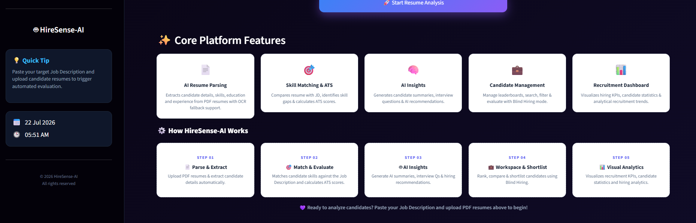

# 🚀 HireSense-AI

### Smart Recruitment Analytics System using Artificial Intelligence


---

# 📖 Overview

**HireSense-AI** is a Smart Recruitment Analytics System developed as a **Bachelor of Computer Applications (BCA) Major Project**.

The project is designed to simplify the resume screening process. It helps recruiters upload resumes, compare them with job descriptions, calculate ATS scores, identify skill gaps, and generate AI-based hiring insights using Google Gemini AI.

The application also provides candidate management, recruitment analytics, and report generation through an interactive Streamlit interface. The main objective of this project is to make the recruitment process faster, more organized, and easier to manage.

---

# ✨ Key Features

## 📄 Resume Analysis

- PDF Resume Parsing
- Candidate Information Extraction
- Education Detection
- Experience Detection
- Technical Skill Extraction

## 🎯 ATS Evaluation

- ATS Score Calculation
- Job Description Matching
- Skill Gap Analysis
- Explainable ATS Score Breakdown
- Hiring Recommendation

## 🤖 AI Features

- AI Candidate Summary
- SWOT Analysis
- AI Hiring Recommendation
- AI Interview Question Generator
- Explainable AI Insights (XAI)

## 👥 Candidate Management

- Bulk Resume Processing
- Duplicate Candidate Detection
- Blind Hiring Support
- Candidate Search
- Candidate Ranking
- Candidate Record Management

## 📊 Dashboard & Analytics

- Interactive Dashboard
- Recruitment KPIs
- ATS Score Distribution
- Candidate Analytics
- Skill Distribution

## 📤 Report Generation

- PDF Report Export
- CSV Export
- TXT Export

---

# 🏗️ System Workflow

```text
Resume Upload
      │
      ▼
Resume Parsing
      │
      ▼
Candidate Information Extraction
      │
      ▼
Skill Matching
      │
      ▼
ATS Score Calculation
      │
      ▼
Google Gemini AI
      │
      ▼
AI Summary • SWOT Analysis • Interview Questions
      │
      ▼
SQLite Database
      │
      ▼
Dashboard & Candidate Management
      │
      ▼
Report Generation (PDF • CSV • TXT)
```

---

# 🛠️ Technology Stack

| Category | Technology |
|----------|------------|
| Programming Language | Python |
| Frontend | Streamlit |
| Database | SQLite |
| Artificial Intelligence | Google Gemini AI |
| Resume Parsing | pdfplumber |
| Data Processing | Pandas |
| Data Visualization | Plotly |
| PDF Report Generation | FPDF2 |
| Environment Variables | python-dotenv |

---

# 📁 Project Structure

```text
HireSense-AI
│
├── Home.py
├── ai_service.py
├── ats_engine.py
├── database.py
├── resume_parser.py
├── skill_matcher.py
├── requirements.txt
│
├── database/
│
├── pages/
│   ├── _Resume_Analyzer.py
│   ├── _Dashboard.py
│   ├── _Candidate_Management.py
│   └── _AI_Insights.py
│
├── screenshots/
│
└── README.md
```

---

# 🚀 Getting Started

## 1. Clone the Repository

```bash
git clone https://github.com/shraddhasinha7777/HireSense-AI.git
```

## 2. Install Dependencies

```bash
pip install -r requirements.txt
```

## 3. Configure Environment Variables

Create a `.env` file in the project folder and add your Gemini API key.

```env
GEMINI_API_KEY=YOUR_API_KEY
```

## 4. Run the Application

```bash
streamlit run Home.py
```

---

# 🎯 Core Modules

- 🏠 Home
- 📄 Resume Analyzer
- 📊 Dashboard
- 👥 Candidate Management
- 🤖 AI Insights

---

# 📌 Core Functionalities

- Resume Parsing
- ATS Score Calculation
- Resume and Job Description Matching
- Skill Gap Analysis
- Explainable AI
- AI Candidate Summary
- SWOT Analysis
- AI Hiring Recommendation
- AI Interview Question Generation
- Candidate Management
- Blind Hiring
- Candidate Ranking
- Dashboard & Analytics
- PDF Report Export
- CSV Export
- TXT Export

---

# 📷 Application Preview

## 🏠 Home




---

## 📄 Resume Analyzer


---

## 📊 Dashboard


---

## 👥 Candidate Management


---

## 🤖 AI Insights


---

# 👩‍💻 Developed By

**Shraddha**

Bachelor of Computer Applications (BCA)

Amrita AHEAD

Amrita Vishwa Vidyapeetham

Academic Major Project • 2026

---

# 🌟 Project Highlights

- AI-Based Resume Screening
- ATS Score Evaluation
- Google Gemini AI Integration
- Interactive Dashboard
- Candidate Management System
- Developed as a BCA Major Project

---

## ⭐ Future Enhancements

- Support for multiple job descriptions
- Resume ranking using semantic similarity
- Email notification feature
- User authentication
- Cloud database integration
- Interview scheduling support

---

### Developed as a BCA Major Project to explore the use of Artificial Intelligence in recruitment.
