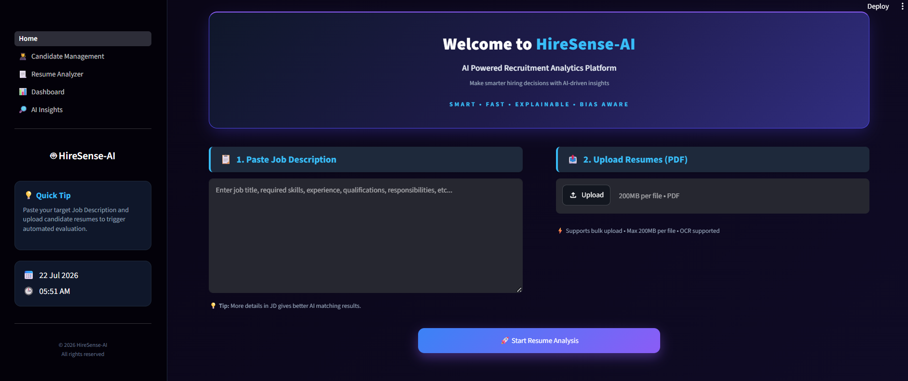
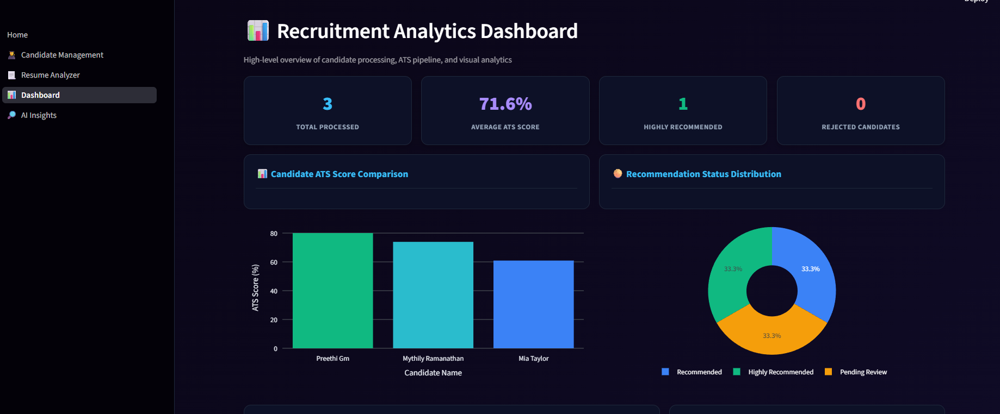
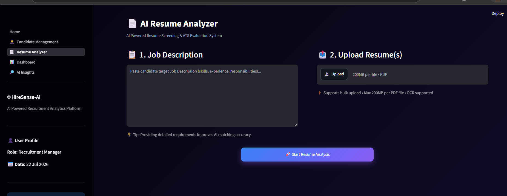

# 🚀 HireSense-AI

### AI-Powered Smart Recruitment Analytics System

> **An AI-powered recruitment platform that automates resume screening, ATS evaluation, and candidate shortlisting.**


---

## 🌟 Highlights

- 🤖 Google Gemini AI Integration
- 🎯 ATS-Based Resume Evaluation
- 📄 Resume Parsing & Skill Matching
- 📊 Interactive Recruitment Dashboard
- 👥 Candidate Management
- 📤 PDF, CSV & TXT Report Export

---

## 📖 Overview

**HireSense-AI** is an AI-powered Smart Recruitment Analytics System developed as a **Bachelor of Computer Applications (BCA) Major Project**.

The application simplifies the recruitment process by analyzing resumes, matching them with job descriptions, calculating ATS scores, identifying skill gaps, and generating AI-powered candidate insights using **Google Gemini AI**. It also provides candidate management, recruitment analytics, and report generation through an interactive Streamlit interface.

---

## 💡 Why HireSense-AI?

Recruiters often spend significant time manually reviewing resumes. **HireSense-AI** automates the initial screening process, enabling faster and more informed hiring decisions through ATS evaluation, AI-powered insights, and centralized candidate management.

---

## ✨ Key Features

- 📄 Resume Parsing & Candidate Information Extraction
- 🎯 ATS Scoring & Job Description Matching
- 📊 Skill Matching & Skill Gap Analysis
- 🤖 AI Candidate Summary, SWOT Analysis & Interview Question Generator
- 👥 Candidate Management & Blind Hiring Support
- 📈 Recruitment Dashboard & Analytics
- 📤 PDF, CSV & TXT Report Export

---

## 🔄 Workflow

```text
Resume(s) + Job Description
            │
            ▼
      Resume Parsing
            │
            ▼
Candidate Information Extraction
            │
            ▼
 Job Description Matching
            │
            ▼
 Skill Matching & ATS Scoring
            │
            ▼
 Google Gemini AI Insights
            │
            ▼
 Store Results in SQLite
            │
            ▼
 Dashboard • Resume Analyzer
 Candidate Management • AI Insights
```

---

## 🛠 Tech Stack

| Category | Technology |
|----------|------------|
| Language | Python |
| Framework | Streamlit |
| Database | SQLite |
| AI | Google Gemini AI |
| Resume Parsing | pdfplumber |
| Data Processing | Pandas |
| Visualization | Plotly |
| Report Generation | FPDF2 |
| Environment | python-dotenv |

---

## 📂 Project Structure

```text
HireSense-AI
│
├── Home.py
├── ai_service.py
├── ats_engine.py
├── database.py
├── resume_parser.py
├── skill_matcher.py
├── requirements.txt
│
├── database/
├── pages/
│   ├── Resume Analyzer
│   ├── Dashboard
│   ├── Candidate Management
│   └── AI Insights
│
├── screenshots/
└── README.md
```

---

## 📸 Application Preview

| Home | Dashboard |
|------|-----------|
|  |  |

| Resume Analyzer | AI Insights |
|-----------------|-------------|
|  |  |

---

## 🚀 Getting Started

```bash
git clone https://github.com/shraddhasinha7777/HireSense-AI.git
cd HireSense-AI
pip install -r requirements.txt
```

Create a `.env` file:

```env
GEMINI_API_KEY=YOUR_API_KEY
```

Run the application:

```bash
streamlit run Home.py
```

---

## 👩‍💻 Developed By

**Shraddha*

Bachelor of Computer Applications (BCA)  
Amrita AHEAD • Amrita Vishwa Vidyapeetham

**Academic Major Project • 2026**
